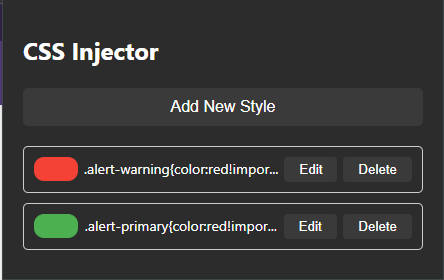

# CSS Injector Chrome Extension

## Overview
`CSS_Injector_Extension` is a Chrome extension using Manifest V3 that allows users to personalize the appearance of web pages by injecting custom CSS. The extension offers a clean and modern interface, making it easy and intuitive to manage and persist custom styles across page visits.

### Features
- Apply and manage custom CSS styles for specific websites.
- Visually appealing UI with toggle switches for styles on and off.
- Add, edit, and delete custom CSS entries.
- Lightweight extension with no user authentication required.
- Local storage of custom styles, not synchronizing across browsers or devices.

## User Stories
1. Users can enjoy a modern UI while interacting with the extension.
2. Custom CSS styles can be easily applied and adjusted using toggles and buttons.
3. New CSS styles can be added via a dedicated button.
4. Custom styles can be exported for use in other browsers or sharing.
5. Custom CSS styles can be managed in a listing, each with individual toggles.

## Technologies
- HTML
- CSS3
- JavaScript
- Chrome Extension API

## Setup
To install the extension:
1. Open Google Chrome and navigate to `chrome://extensions/`.
2. Enable Developer Mode at the top right.
3. Click on 'Load unpacked' and select the extension directory.

## Files Structure
- `background.js` - Handles extension installation and CSS injection.
- `manifest.json` - Contains metadata and configurations for the Chrome extension.
- `popup.html/css/js` - Controls the popup UI functionality.
- `new-style.html/css` - UI for adding new custom CSS styles.
- `validator.js` - Validates CSS input from the user.
- `styles/themes.css` - Defines theme-related styles.
- `content.js` - Injects and manages CSS in web pages.
- `icons/` - Contains icons used in the extension.

## Contributions
Contributions are welcome. Please feel free to submit pull requests or create issues for bugs and feature requests.

## License
This project is licensed under the MIT License - see the LICENSE file for details.

## Disclaimer
This extension comes with no warranty or support. Use at your own risk.

---

*Note: This documentation is for the current state of the project. Further updates and changes are anticipated.*